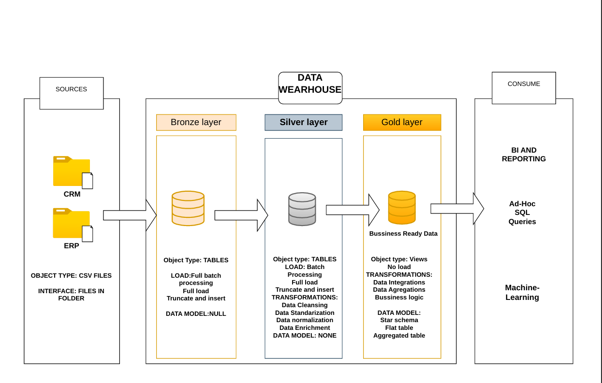

# SQL-DATA-WAREHOUSE

# 🚀 SQL Data Warehouse Project | PostgreSQL Data Engineering Pipeline

## 📌 Project Overview

This project demonstrates the end-to-end development of a modern Data Warehouse using PostgreSQL following the Medallion Architecture (Bronze → Silver → Gold).

The objective is to transform raw source data into clean, standardized, and analytics-ready datasets through a structured ETL process.

The project covers:

* Data Ingestion
* Data Cleansing
* Data Standardization
* Data Validation
* Data Transformation
* Dimensional Modeling
* Analytical Data Preparation

---

# 🏗️ Architecture



---

# 🛠️ Technology Stack

| Technology | Purpose                 |
| ---------- | ----------------------- |
| PostgreSQL | Data Warehouse          |
| SQL        | Data Transformation     |
| pgAdmin 4  | Database Administration |
| Git        | Version Control         |
| GitHub     | Project Repository      |

---

# 📂 Project Structure

```text
DataWarehouse/
│
├── datasets/
│
├── scripts/
│   ├── bronze_layer.sql
│   ├── silver_layer.sql
│   ├── gold_layer.sql
│
├── docs/
│
├── screenshots/
│
└── README.md
```

---

# 🥉 Bronze Layer

The Bronze Layer stores raw source data exactly as received from operational systems.

### Objectives

* Preserve source data integrity
* Maintain historical records
* Enable auditability
* Support data lineage

### Tables

* crm_cust_info
* crm_prd_info
* crm_sales_details
* erp_cust_az12
* erp_loc_a101
* erp_px_cat_g1v2

---

# 🥈 Silver Layer

The Silver Layer performs data cleansing, validation, and standardization.

## Customer Transformations

✔ Removed duplicate customer records

✔ Trimmed unnecessary spaces

✔ Standardized gender values

✔ Standardized marital status values

### Example

```sql
TRIM(cst_firstname)
TRIM(cst_lastname)
```

---

## Product Transformations

✔ Extracted category identifiers

✔ Standardized product line descriptions

✔ Replaced NULL product costs

✔ Generated product validity periods

### Example

```sql
COALESCE(prd_cost,0)
```

---

## Sales Transformations

✔ Validated order dates

✔ Validated shipping dates

✔ Corrected invalid sales values

✔ Recalculated missing prices

### Example

```sql
TO_DATE(sls_order_dt::TEXT,'YYYYMMDD')
```

---

## ERP Transformations

✔ Standardized customer identifiers

✔ Cleaned country codes

✔ Validated future birth dates

✔ Standardized gender information

---

# 🥇 Gold Layer

The Gold Layer provides business-ready analytical datasets optimized for reporting and dashboarding.

### Objectives

* Business Intelligence
* KPI Reporting
* Dashboard Development
* Data Analytics

Potential Gold Layer Models:

### Fact Tables

* FactSales

### Dimension Tables

* DimCustomer
* DimProduct
* DimLocation
* DimDate

---

# 📊 Data Quality Checks

The following validation checks were performed:

### Duplicate Detection

```sql
ROW_NUMBER() OVER (
PARTITION BY cst_id
ORDER BY cst_create_date DESC
)
```

### Null Handling

```sql
COALESCE(prd_cost,0)
```

### Data Standardization

```sql
UPPER(TRIM(column_name))
```

### Date Validation

```sql
TO_DATE(date_column::TEXT,'YYYYMMDD')
```

---

# 📈 Key Features

* End-to-End Data Warehouse Design
* PostgreSQL-Based ETL Pipeline
* Medallion Architecture
* Data Cleansing & Standardization
* Slowly Changing Dimension Handling
* Window Functions
* Analytical Data Modeling
* Production-Style SQL Development

---

# 🎯 Learning Outcomes

Through this project, I gained hands-on experience in:

* Data Warehousing Concepts
* ETL Development
* PostgreSQL SQL Programming
* Window Functions
* Data Quality Management
* Data Modeling
* Analytical Data Preparation
* Real-World Data Engineering Workflows

---

# 📸 Project Screenshots

Add screenshots here:

### Bronze Layer


### Silver Layer


### Gold Layer


---

# 👨‍💻 Author

**Sashi Preetham**

Aspiring Data Engineer | SQL Developer | Data Analyst

LinkedIn: [Your LinkedIn URL]

GitHub: [Your GitHub URL]

---

# ⭐ Acknowledgements

This project was inspired by industry-standard Data Engineering practices and modern Data Warehouse architectures used in enterprise environments.

If you found this project useful, consider giving it a ⭐ on GitHub.
